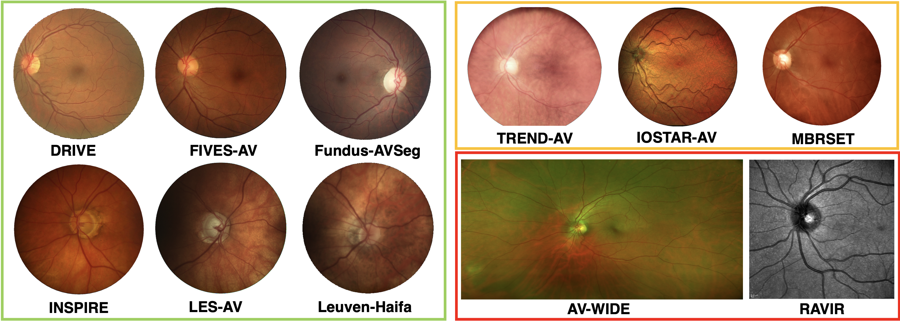
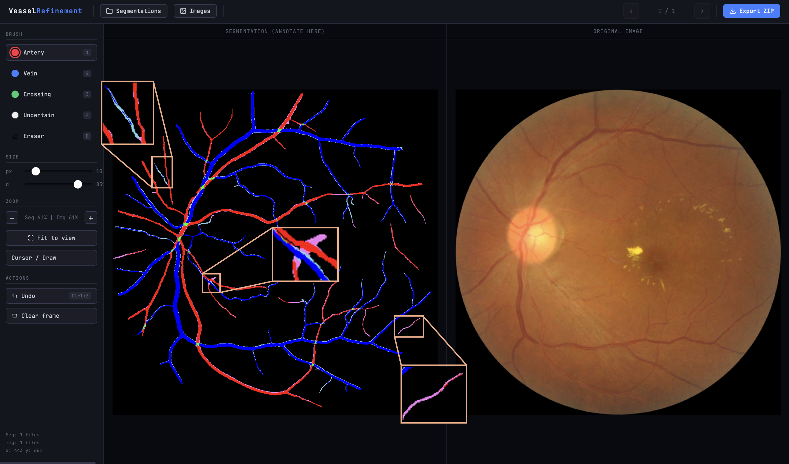

# OCULAR: Open-source Collection of Unified Large-scale Artery-vein Retinae

OCULAR provides a harmonized large-scale dataset of retinal artery-vein (A/V) annotations and **OCULARNet**, a model trained to prioritize clinically relevant vascular biomarkers over pixel-wise overlap.  

## Table of Contents
- [Dataset](#dataset)  
- [Pre-trained Model](#pre-trained-models)  
- [Installation & Dependencies](#installation--dependencies)  
- [Inference Pipeline](#inference)  
- [Zone Extraction](#zone-extraction)
- [Release of New A/V Annotations](#release-of-new-artery-vein-annotations)
- [Citation](#citation)  

---

## Dataset

OCULAR aggregates a diverse collection of publicly available retinal A/V datasets for **training**, **in-distribution (ID) testing**, and **out-of-distribution (OoD) evaluation**. 
Each block below corresponds to these splits.



*Figure 1. Illustrative retinal fundus images highlighting distribution shifts across datasets. **Left:** in-distribution (ID, green) examples from HRF, LES-AV, INSPIRE, and DRIVE used for model development. **Right:** representative out-of-distribution (OoD) images from near-OoD (TREND-AV, IOSTAR-AV, and MBRSET; yellow) and far-OoD (AV-WIDE, RAVIR; red) datasets showcasing substantial variability in imaging conditions, brightness, resolution, and field-of-view.*

Below, we provide links to the original datasets (*Download Dataset*). We also release processed field-of-view (FOV) masks (original resolution) and optic disc annotations (after cropping to FOV and resizing to 1024x1024) whenever the original dataset did not provide them (*Download OD-FOV*). Leuven-Haifa, MBRSET, RAVIR and UNAF images are cropped to the FOV, so we don't provide masks either. 

---

### Training Datasets

| Dataset | N | Center | FOV | Resolution (px) | Region | Pathologies | Download Dataset | Download OD-FOV |
|--------|---|--------|-----|----------------|--------|-------------| ----------- | -------- |
| AVRDB | 100 | M,D | 45° | 1000×1054 | PK | HR | [[Link]](https://www.researchgate.net/publication/319165214_AVRDB_Annotated_Dataset_for_Vessel_Segmentation_and_Calculation_of_Arteriovenous_Ratio) | [[Link]](https://drive.google.com/drive/folders/1pAuM8KGVZFWE35e0VF-HXUHxsVv14qiR?usp=drive_link)
| DRIVE | 40 | M | 45° | 584×565 | NL | DR | [[Link]](https://www.kaggle.com/datasets/andrewmvd/drive-digital-retinal-images-for-vessel-extraction) | [[Link]](https://drive.google.com/drive/folders/1IAJVZvx36Gxd-zY1H0RzbREOIV5jE8Yf?usp=drive_link)
| ENRICH | 111 | M,D | 45° | 1958×2196 | BE | -- | [[Link]](https://www.kaggle.com/datasets/ba1b909c12dbe6c08df00b3ee6fc22d2fef632870359f91384b9001a870f67bf) | [[Link]](https://drive.google.com/drive/folders/12dSfWLPkDavscX6YDOj5T2MUDH60xKJz?usp=drive_link)
| FIVES-AV | 75 | M | 45° | 1444×1444 | CN | -- | [[Link]](https://www.kaggle.com/datasets/ba1b909c12dbe6c08df00b3ee6fc22d2fef632870359f91384b9001a870f67bf) | [[Link]](https://drive.google.com/drive/folders/1kWVsiLnJFULJugtEcSfNg5H9tD29aOHJ?usp=drive_link)
| Fundus-AVSeg | 100 | M | 45° | 1280×1280 | CN | -- | [[Link]](https://figshare.com/projects/Fundus-AVSeg_A_Fundus_Image_Dataset_for_AI-based_Artery-Vein_Vessel_Segmentation/229986) | [[Link]](https://drive.google.com/drive/folders/1EtX0-GT1YL3TnOgaqB1XqqWV2J1PHUxs?usp=sharing)
| GAVE | 50 | M | 45° | 1536×1024 | CN | -- |[[Link]](https://zenodo.org/records/15081506) | [[Link]](https://drive.google.com/drive/folders/18Ei7P09KL4Afrzc0g0itct6JvnCPjM7T?usp=sharing)
| GRAPE | 81 | M,D | 50° | 1444×1444 | CN | G | [[Link]](https://www.kaggle.com/datasets/ba1b909c12dbe6c08df00b3ee6fc22d2fef632870359f91384b9001a870f67bf) | [[Link]](https://drive.google.com/drive/folders/1WkSvGANC2sJ2GMM21ksZwoPK_9d4vJqN?usp=sharing)
| HRF | 45 | M | 45° | 3504×2336 | DE | DR,G | [[Link]](https://www5.cs.fau.de/research/data/fundus-images/) | [[Link]](https://drive.google.com/drive/folders/1qKmhGe2GAQbGy6jbDwjTnYVs3_gd_s29?usp=sharing)
| INSPIRE | 15 | D | 30° | 1444×1444 | US | POAG | [[Link]](https://eye.medicine.uiowa.edu/inspire-datasets) | [[Link]](https://drive.google.com/drive/folders/190G5aEG0jtR0F8dvlJ89NOpArRQXVlHz?usp=sharing)
| LES-AV | 22 | D | 30° | 1620×1444 | BE | G | [[Link]](https://figshare.com/articles/dataset/LES-AV_dataset/11857698) | [[Link]](https://drive.google.com/drive/folders/1Jp8EHj-dMsvm3TqOxGJXbtfePTSCXkX6?usp=sharing)
| Leuven-Haifa | 240 | D | 30° | 1444×1444 | BE | G | [[Link]](https://rdr.kuleuven.be/dataset.xhtml?persistentId=doi:10.48804/Z7SHGO) | [[Link]](https://drive.google.com/drive/folders/1-bHKysVBY_-oZZYC9fdrQxYGCrW6HoPZ?usp=sharing)
| MAGREBHIA | 69 | M,D | 30° | 1444×1444 | NAf | G |[[Link]](https://www.kaggle.com/datasets/ba1b909c12dbe6c08df00b3ee6fc22d2fef632870359f91384b9001a870f67bf) | [[Link]](https://drive.google.com/drive/folders/13KEYxEdoZJxsuX5v6PNy798357tGcBbq?usp=sharing)
| MESSIDOR-AV | 66 | M | 45° | 1444×1444 | FR | DR | [[Link]](https://www.kaggle.com/datasets/ba1b909c12dbe6c08df00b3ee6fc22d2fef632870359f91384b9001a870f67bf) | [[Link]](https://drive.google.com/drive/folders/19oXwqQ5zHSzzGQHb10mH44iKFhnKhIrU?usp=sharing)
| PAPILA | 78 | D | 30° | 1444×1444 | ES | G | [[Link]](https://www.kaggle.com/datasets/ba1b909c12dbe6c08df00b3ee6fc22d2fef632870359f91384b9001a870f67bf) | [[Link]](https://drive.google.com/drive/folders/13CH7O2qGY4hmRf9wHw92bBt0tXks66DX?usp=sharing)

---

### In-Distribution Test Datasets

| Dataset | N | Center | FOV | Resolution (px) | Region | Pathologies | Download Dataset | Download OD-FOV |
|--------|---|--------|-----|----------------|--------|-------------| ----------- | -------- |
| DualModal | 30 | M | 45° | 1024×1024 | CN | H | [[Link]](https://ieee-dataport.org/documents/dualmodal2019-dataset#files) | [[Link]](https://drive.google.com/drive/folders/19LOoFHlihdUcKpfhZ54uolqG2r_EXER4?usp=sharing) |
| UNAF | 15 | D | 45° | 1444×1444 | PY | DR | [[Link]](https://iopscience.iop.org/article/10.1088/1361-6579/ad3d28) | [[Link]](https://drive.google.com/drive/folders/10cKE-qjRRJ3giyzMUAaev1u3CEkf5kWu?usp=sharing) |

---

### Out-of-Distribution Test Datasets

| Dataset | N | Center | FOV | Resolution (px) | Region | Pathologies | Download Dataset | Download OD-FOV |
|--------|---|--------|-----|----------------|--------|-------------| ----------- | -------- |
| AV-WIDE | 26 | M | 200° | 829×1531 | US | AMD | [[Link]](https://www.kaggle.com/datasets/ba1b909c12dbe6c08df00b3ee6fc22d2fef632870359f91384b9001a870f67bf) | [[Link]](https://drive.google.com/drive/folders/18dT8ATsgpJXR-NGRcRUF3owGvbLm_2xs?usp=sharing)
| IOSTAR-AV | 30 | M,D | 45° | 1024×1024 | NL | -- | [[Link]](https://www.retinacheck.org/download-iostar-retinal-vessel-segmentation-dataset) | [[Link]](https://drive.google.com/drive/folders/1n15NhE6ZB8NGve1fHxTYsxl5t7v0B-A1?usp=sharing)
| MBRSET | 30 | M | 30° | 1444×1444 | BR | DR | [[Link]](https://www.kaggle.com/datasets/ba1b909c12dbe6c08df00b3ee6fc22d2fef632870359f91384b9001a870f67bf) | [[Link]](https://drive.google.com/drive/folders/13OlYGy_LLW0TCsnu9XfOFsqzOZRDoguj?usp=sharing)
| RAVIR | 36 | D | 30° | 768×768 | US | DR,HR |[[Link]](https://ravirdataset.github.io/data/) | [[Link]](https://drive.google.com/drive/folders/17JBfOPTyHz5A3e4IdmrSu5siWqRJz6bX?usp=sharing)
| TREND-AV | 48 | M | 45° | 1444×1444 | ME | H | [[Link]](https://www.kaggle.com/datasets/ba1b909c12dbe6c08df00b3ee6fc22d2fef632870359f91384b9001a870f67bf) | [[Link]](https://drive.google.com/drive/folders/1HXWfSHnAWyxZAySROx9KDmEfjeMHOwts?usp=sharing)

**Abbreviations:**  
M: macula-centered, D: optic disc-centered  
FOV: field of view  
DR: diabetic retinopathy, G: glaucoma, HR: hypertensive retinopathy  
POAG: primary open-angle glaucoma, AMD: age-related macular degeneration, ME: macular edema, H: healthy;

PK: Pakistan, NL: Netherlands, CN: China, BL: Belgium, UK: United Kingdom, US: United States of America, DE: Deutschland, 
PY: Paraguay, FR: France, ES: Spain, NAf: North Africa, BR: Brazil, CR: Croatia, IN: India, CAN: Canada, AUS: Australia.

---

## Pre-trained Models

### OCULARNet

Download the OCULARNet pre-trained weights from Hugging Face:

```bash
wget https://huggingface.co/Anon-User-Retina/OCULARNet/resolve/main/OCULARNet.pth
```

- Model: `base_unet_repvgg_b3`
- Classes: background, artery, vein, crossings

### OCULARNet-nano (5-fold Ensemble)

Download the OCULARNet-nano ensemble weights from Hugging Face:

```bash
wget https://huggingface.co/Anon-User-Retina/OCULARNet-nano/resolve/main/nano_f1.pth
wget https://huggingface.co/Anon-User-Retina/OCULARNet-nano/resolve/main/nano_f2.pth
wget https://huggingface.co/Anon-User-Retina/OCULARNet-nano/resolve/main/nano_f3.pth
wget https://huggingface.co/Anon-User-Retina/OCULARNet-nano/resolve/main/nano_f4.pth
wget https://huggingface.co/Anon-User-Retina/OCULARNet-nano/resolve/main/nano_f5.pth
```

- Model: `base_unet_repvgg_a0`
- Classes: background, artery, vein, crossings

## Installation & Dependencies

Clone the repository and install dependencies:

```bash
git clone https://github.com/anon-retina/OCULAR.git
cd OCULAR
pip install -r requirements.txt
```

## Inference

- **Images** (RGB format, already cropped) should be placed in:
  `data/images/`

- **Model weights** should be placed in:

  **OCULARNet**
  ```text
    pretrained_weights/OCULARNet/OCULARNet.pth
  ```
  
  **OCULARNet-nano (5-fold ensemble)**
  ```text
    pretrained_weights/OCULARNet-nano/
    ├── nano_f1.pth
    ├── nano_f2.pth
    ├── nano_f3.pth
    ├── nano_f4.pth
    └── nano_f5.pth
  ```

- **Run inference** with the full OCULARNet model:

```bash
  python inference.py \
      --input_dir data/images \
      --output_dir segmentations/ \
      --weights pretrained_weights/OCULARNet/OCULARNet.pth \
      --device cuda
```

- **Run inference** with the OCULARNet-nano ensemble:

```bash
  python inference.py \
      --input_dir data/images \
      --output_dir segmentations/ \
      --weights pretrained_weights/OCULARNet-nano/nano_f1.pth \
      --ensemble \
      --device cuda
```

---

## Zone Extraction

This script processes a `data/` folder containing retinal fundus images and associated vessel/optic disc/crossings segmentations to generate **junction and vessel zone masks** used for analysis. For each image:

- **Bifurcations (arteries & veins):**  
  Extracts geometric bifurcation points using the PBVM method (`handle_interpoints`) and produces a binary ROI mask (20px diameter) per vessel type.

- **Major vasculature (arteries & veins):**  
  Computes major vessel regions either via morphological opening relative to the optic disc size (`mode="opening"`) or by selecting the largest connected components (`mode="largest_cc"`). User can also manually input the footprint width (fw), we recommend values between 2-4 and visual inspection of the results.

- **Crossings ROIs:**  
  Generates circular masks (20px diameter) around the centroids of crossing regions detected in the input segmentation.

### Folder Requirements

The following folders must exist inside the root `data/` directory:

- `images/` — RGB fundus images (`.png`)
- `artery/` — binary artery segmentation masks (`.png`)
- `vein/` — binary vein segmentation masks (`.png`)
- `optic_disc/` — optic disc segmentation masks (`.png`)
- `crossings/` — binary crossings segmentation masks (`.png`)

Each file should be named consistently across all folders.

### Example Data Download

[Download example data.zip](https://drive.google.com/file/d/1x01n3sbI_QUy8DxjQ2KSqKypHZpYw8Wy/view?usp=drive_link)

### How to Run

```bash
python extract_zones.py --data_root /path/to/data \
                        --image_type ODC \
                        --fw 3
```

---

## Release of New Artery-Vein Annotations

### Datasets

Upon paper publication, we will release artery-vein segmentations extracted with OCULAR and semi-automatically refined using ground-truth binary vessel annotations for the following open-source datasets (1,791 images):

| Dataset | N | Center | FOV | Resolution (px) | Region | Pathologies | Download |
|--------|---|--------|-----|----------------|--------|-------------| --------|
| ARIA | 143 | M | 50° | 576x768 | UK | DR, AMD | [[Link]](https://www.researchgate.net/post/How_can_I_find_the_ARIA_Automatic_Retinal_Image_Analysis_Dataset)
| CHASE_DB1 | 28 | D | 30° | 1280x960 | UK | H | [[Link]](https://www.kaggle.com/datasets/rashasarhanalharthi/chase-db1)
| DR HAGIS | 40 | M | 45° | [1880x2816], [1944x2896], [2136x3216], [2304x3456], [3168x4752] | UK | G, DR, AMD, HR | [[Link]](https://www.kaggle.com/datasets/ba1b909c12dbe6c08df00b3ee6fc22d2fef632870359f91384b9001a870f67bf)
| DRiDB | 50 | M | 45° | 576×720 | CR | DR | [[Link]](https://ipg.fer.hr/ipg/resources/image_database)
| FIVES | 800 | M | 50° | 2048×2048 | CN | DR, POAG, AMD | [[Link]](https://figshare.com/articles/figure/FIVES_A_Fundus_Image_Dataset_for_AI-based_Vessel_Segmentation/19688169)
| FOVEA | 80 | M | 45° | [1080x1920], [1934x1960] | UK | -- |[[Link]](https://github.com/rvimlab/FOVEA)
| IDRiD | 81 | M | 50° | 2848x4288 | IN | DR | [[Link]](https://www.kaggle.com/datasets/aaryapatel98/indian-diabetic-retinopathy-image-dataset)
| MESSIDOR-MAPLES-DR | 198 | M | 30° | 1444×1444 | FR | DR, ME | [[Link]](https://github.com/LIV4D/MAPLES-DR)
| ORVS | 49 | D | 30° | 1444×1444 | CAN | -- | [[Link]](https://github.com/openmedlab/Awesome-Medical-Dataset/blob/main/resources/ORVS.md)
| STARE | 18 | M | 35° | 605×700 | US | POAG | [[Link]](https://cecas.clemson.edu/~ahoover/stare/)
| TREND | 72 | M | 45° | 2560×1960 | BE | G | [[Link]](https://zenodo.org/records/4521044)
| UoA-DR | 200 | M, D | 45° | 1024×1024 | AUS | DR | [[Link]](https://auckland.figshare.com/articles/journal_contribution/UoA-DR_Database_Info/5985208)
| VEVIO | 32 | M | 30° | 640x480 + mosaics | US | -- |[[Link]](https://people.duke.edu/~sf59/Estrada_BOE_2012.htm)

### Semi-Automatic Refinement Procedure

A/V annotation correction consisted in the following steps:

1) 4-class (background, B; artery, A; vein, V; crossing; C) probability map extraction in 1024x1024 resolution using OCULAR-Net.
2) Bicubic resizing plus Li threshold of corresponding ground-truth (GT) binary vessel maps to 1024x1024 resolution. Since we train at 1024x1024, we must refine at that resolution to encourage the best possible ground-truth quality.
3) Removal of FP using the GT vessel mask.
4) Addition of missing vessels (FNs) using the probability maps. At a FP pixel, where the model predicted B, we know $\textit{via}$ the GT maps that a vessel exists. Therefore, we momentarily assign the next most probable class, and annotate it using the following "soft" color palette:

```
class_to_color = {
1: [238, 130, 238], #violet for arteries
2: [135, 206, 235],  #sky blue for veins
3: [180, 180, 0]     #dark yellow for crossings
}
```

5) Finally, pixels which were assigned a vessel class and fall inside the vessel GT, are kept as the model predicted. This 5-step process generates a 7-color segmentation map ready for manual refinement.
6) Using our own-built app, `annotation_tool.html`, we correct errors by "painting" on top of the pre-refined segmentation. Our app allows for the 3 canonical vessel classes and further allows an $\textit{uncertain}$ class in ambiguous situations. If a pixel is annotated as class $x$, it will be assigned that class in the final refined segmentation. Otherwise, if it was a TP it maintains its class; if it was a FN, it is assigned the corresponding hard label (i.e., from violet to red in arteries). Our tool saves the manual annotations as .png files. Resulting segmentations are multiplied with the GT vessel mask to eliminate FPs from the annotation process. 



*Figure 2. Vessel refinement tool screenshot with zoomed-in failure modes from a FIVES sample. Our tool allows the selection of brush class (color) & size, independent zoom for each view (segmentation, left; original fundus image, right) and annotation export in .zip files. The three failure modes are: (top left) artery bifurcates into a vein, i.e., label swap across a segment; (middle) missed a/v crossing; (bottom right) small independent vessel for which a label cannot be confidently assigned, i.e. uncertain.*

### Usage

**(1) Pre-refine single sample**

```bash
python vessel_refinement.py prerefine \
  --prob path/to/prob.npy \
  --vessel path/to/vessel.png \
  --out output.png
```

After refining with our annotation tool:

**(2) Final segmentation extraction**

```bash
python vessel_refinement.py refine \
  --prerefined path/to/prerefined.png \
  --annotation path/to/annotation.png \
  --vessel path/to/vessel.png \
  --out final.png
```

---

## Citation

If you use OCULAR or OCULARNet in your work, please cite:

```bash
@inproceedings{OCULAR2026,
  title={Beyond Dice: Clinically Meaningful Large-Scale Retinal Artery/Vein Segmentation},
  author={},
  booktitle={},
  year={2026}
}
```
